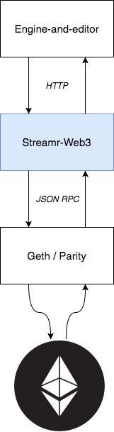

# Streamr-Web3: Streamr-Ethereum bridge
An optional service of the Streamr cloud architecture that facilitates interactions with the Ethereum blockchain.
Engine-and-Editor's Ethereum modules require this service to be active in order to work.



## Dependencies

* [Node.js](https://docs.npmjs.com/getting-started/installing-node)
* [Geth](https://github.com/ethereum/go-ethereum/wiki/Building-Ethereum) or [Parity]() Ethereum client
* [Ganache the Ethereum dummy-client/simulator](https://github.com/trufflesuite/ganache-cli) for testing

## Building and running

Project uses npm for package management. We provide sensible default configurations for IntelliJ IDEA and VSCode but project can be developed with other IDEs as well.

- Install npm dependencies with `npm install`
- Specify `ETHEREUM_SERVER_URL` and `PORT` in environment variables and run `npm run start`
- OR run it with `./start-rinkeby-local`, `./start-rinkeby-infura`, `./start-ropsten-local`, `./start-ropsten infura` depending on your needs

## Running tests

First console window
```
./node_modules/.bin/ganache-cli -m testrpc
```

Second console window
```
./node_modules/.bin/mocha
```

## Publishing

Currently project has no CI system and/or container configured nor are any packages published to npmjs.com.

## License

This software is open source, and dual licensed under [AGPLv3](https://www.gnu.org/licenses/agpl.html) and an enterprise-friendly commercial license.
